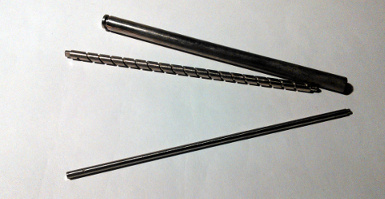
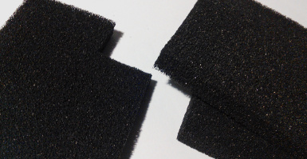
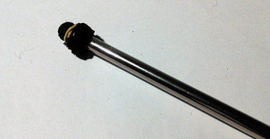
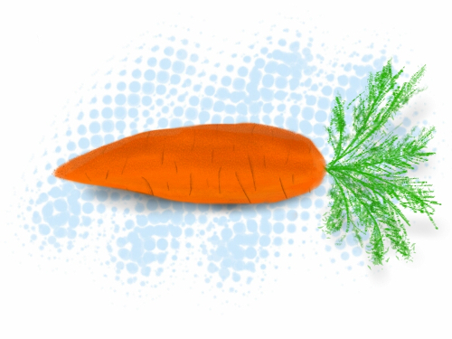

$ You don't have to buy an expensive stylus if you want to paint on your tablet. You probably can make one right away!

This article will show you how to make a simple stylus for your phone or tablet. It should work on all capacitive screens, that is, on all modern phones and tablets.

# Why pencil won't work

In the past, most devices (such as PDAs) used *resisitive* touch screens. Resistive screens are relatively easy to make and use, but don't support multitouch very well, and are not very responsive.

Resistive screen is activated by pressure, so you could operate them with a pencil, stylus, nail or about anything else.

The more modern, *capacitive* touch screens, are triggered by changes of capacitance. Put simple, the charge on your finger is detected by the screen and interpreted as a touch. Obviously, you must use some *conductor* as a stylus in order to transfer the charge from your hand to the screen.

# What makes a stylus

* It must electrically connect your hand with the screen
* The touch point must have at least 0.5 cm in diameter, otherwise it will be ignored by the system
* The point shouldn't scratch your screen (obviously)

Go ahead and try it! Even a spoon makes a good stylus, although it's not very ergonomic.

# Best materials

Old metal pen, a metal stick etc. for the handle

{.img-left}

Conductive foam for the point (used for packaging sensitive electronics)

{.img-left}

(A ball made of aluminium wrapping foil can be used as a point too, but it's worse.)

# What to do with a stylus

Here's an example of a stylus you can make:

{.img-left}

Well, now that you got a stylus, you might as well make some use of it. It can (of course) be used as an alternative to your greasy fingers, but the most awesome thing you can do on a tablet is **painting**.

## Get a proper app

You can find a bunch of free drawing apps on Google Play, but if you're not cheap, don't hesitate and buy a proper tool for few bucks.

I'm using *Sketchbook Pro*, and it's really good - not like the free trash full of ads. But there's a whole lot of other apps, so pick the one that suits you best, and paint something awesome (like the carrot above :D)!
