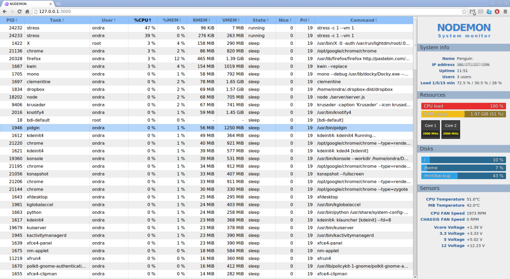

$ Nodemon is a *node.js* based system monitor with web interface. If you want to monitor health of a remote server, this might be a good choice for you.

> Apparently, there's another project called "nodemon" on GitHub. It's just a name collision, they are not related in any way.

# Features

Nodemon uses various command line utilities to obtain the system info. For a full list of dependencies, see the GitHub page (link below).

Here's what data nodemon reads:

- Platform name, kernel version
- Information about CPU cores (frequency, model name etc)
- IP address and hostname
- Disk usage
- Memory usage
- Detailed process table (including memory, cpu, pid, user etc)
- Hardware sensors (temperature, voltage, power, uptime)

## Screenshot

# Download

Nodemon can be downloaded from the GitHub page (tab "Releases"):

- [Nodemon on GitHub][github]

# Installation

## Get the dependencies

Check that you have installed all the dependencies (listed in README). Those should be already installed on most Linux-based systems.

- `procps` >= 3.2.8
- `coreutils` >= 8.13
- `curl` >= 7.22.0
- `grep` >= 2.10
- `df` >= 8.3
- `sensors` >= 3.3.1

You also need:

- `node` >= 0.10.24
- `npm` >= 1.3.21

## Install node modules

Once you have all the required dependencies installed, run `npm install` in the project folder, which should install required node.js packages.

# Getting started

## Running the server

To start *nodemon*, you can use the `nodemon` bash script.

In case it doesn't work, `cd` into the project folder and run `node ./server/server.js`

The server script accepts a whole bunch of command line arguments, which you can see after running it with the `--help` argument (or `-h` if you're lazy).

## Themes

Nodemon front-end (the stuff you get in browser) can be obtained in various flavors, called themes. If you don't like the built-in ones, you can even write your own!

Themes are placed in `client/themes/THEME_NAME`, while they can use files from `client/assets` and the `socket.io` client script. For reference, see how the default theme is made.

Adding a theme is as simple as adding new folder into the `client/themes` folder, particularly the `index.html` is important. Note, that you need to restart nodemon after you add a theme folder for it to have any effect.

In browser, you can then navigate to the folder in order to get a different theme (eg. `ADDRESS:PORT/proc` will give you the "proc" theme.)

[github]: https://github.com/MightyPork/nodemon
