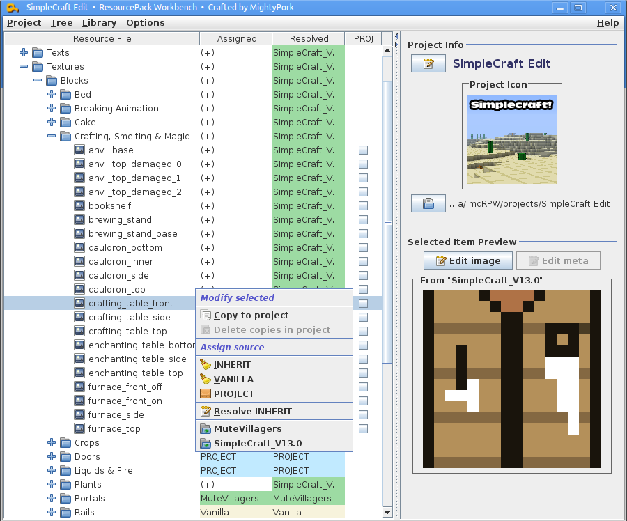

$ RPW is an application for creating Minecraft resourcepacks in an easy, powerful way.

I've made this tool a while ago, and I am not sure how long it will be useful, with the huge changes in 1.7 and the modding API. Nevertheless, it is here now, and it works real good!

# Download & More info

For download and detailed instructions how to use the tool, please visit its post on **[PlanetMinecraft][pmc]**.

## Alternate download

If for some some weird reason the above link didn't work, here's an alternate download:

* **[RPW-LATEST.jar][direct]**

[pmc]: http://www.planetminecraft.com/mod/tool-resourcepack-workbench---the-ultimate-pack-creator/
[direct]: http://dl.dropboxusercontent.com/u/64454818/RPW/RPW-LATEST.jar
