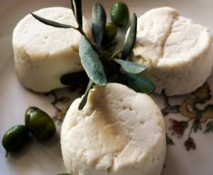

$ *Goat cheese* is an important cultural phenomenon of the 21st century, for it's amazing qualities and features. But why is that?

# Some facts about *goat cheese*

Let's sum it up:

* *Goat cheese* smells real bad.
* Goat milk smells even worse.
* Cow milk is better.

Now, here we have a photo of *goat cheese*. Interestingly, it looks rather tasty - what a nasty deception!

 {.img-left}

Goat milk smells **and** tastes horrible, we can assume that the cheese has similar properties.

*PS. This is a dummy article to test markdown.*
