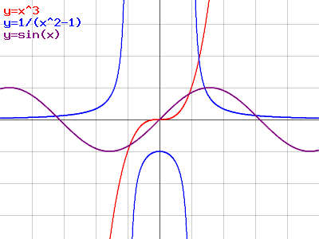

$ MathPlot is a tool for plotting math functions. It's fully online and free to use!

It's a PHP application which generates the images using the GD library. You can define multiple functions and their colors, adjust scale and move around.



# Link

The tool is available here:

* **[ondrovo.com/mathplot][mp]**

*If you want to put the output image somewhere, please save it as PNG, and use that file. Linking to the image-generating script is not only unreliable, but also increases bandwidth and server load.*

# How it works

The page with controls is just a form with an image. This image is generated by the [mathplot_png.php][script] script. By default, it shows some demo functions, but you can tell it what you want to get, of course.

The script takes quite a few **GET parameters**, here's a list of them in case you want to generate images with custom dimensions, grid size or line width.

Here's an extract from the comments of the script.

``` no-highlight
#### Parameters ####
  w  = width (px)
  h  = height (px)
  y  = y offset (units)
  x  = x offset (units)
  xa = show x axis
  ya = show y axis
  t  = line thickness (1 default, 2 medium, 3 thick)
  a  = enable antialiasing (for thicker lines) - default on
  s  = grid scale (pixels per unit)
  sx = x grid scale (pixels per horizontal unit)
  sy = y grid scale (pixels per vertical unit)
  b  = white border (in pixels)
  stamp = enable/disable stamp (copyright info)
  legend = enable/disable legend

Functions syntax
(spaces are optional)

  f = func1():color1; func2():color2

example:

  graph.php?f=sin(x):0xff00ff;cos(x):orange;sin(x--PI/2)--1/x:darkcyan
  (-- used instead of +, as + is encoded in url to %2b, which is ugly)
```

For example the image shown above would be generated like this:

``` no-highlight
mathplot_png.php?b=0&w=400&h=300&x=0&y=0&s=40&f=x^3:red;1/(x^2-1):blue;sin(x):purple&stamp=0
```

(See it [live][live_example])

## Supported functions & stuff

In general, functions use this syntax: `func(arg1, arg2, ...)`

* All basic operations, like `* + - / % ^`
* Goniometric and other functions (sin, cos, tan, log ...)
* `sqrt`, `sum`, `min`, `max`, `floor`, `ceil`, `round`...
* `!` for factorial
* Constants `PI`, `E`

*If it says there's an error in your expression, and you think it should work, please tell me in the comments and I'll try to fix it.*


[mp]: mathplot "MathPlot application"
[script]: mathplot/mathplot_png.php "Drawing script"
[live_example]: mathplot/mathplot_png.php?b=0&w=400&h=300&x=0&y=0&s=40&f=x^3:red;1/(x^2-1):blue;sin(x):purple&stamp=0 "Live demo"
